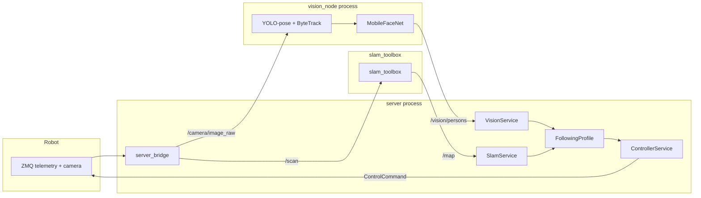

# Vision-профили: архитектура и pipeline

## 1. Текущая архитектура (summary)

### Слои системы

```
┌─────────────────────────────────────────────────────────────────────────┐
│                          Web UI (Flask)                                 │
│  /api/mode  /api/slam/*  /api/lidar  /api/capture  /api/status         │
└────────────────────────────┬────────────────────────────────────────────┘
                             │
┌────────────────────────────▼────────────────────────────────────────────┐
│                      ControllerService                                  │
│                                                                         │
│  tick_once():                                                           │
│    1. Собирает InputState (manual + telemetry + lidar + camera + SLAM)  │
│    2. Передаёт pending_actions в активный профиль                       │
│    3. profile.tick(context, input_state) → ControlCommand               │
│    4. Отправляет ControlCommand в RobotClient                           │
│                                                                         │
│  Хранит:  active_mode, profile_states (persist в server_state.yaml)    │
└────────┬───────────────────────────┬────────────────────────────────────┘
         │                           │
   ┌─────▼──────┐             ┌──────▼─────────┐
   │  Profiles   │             │  RobotClient   │
   │  (behavior) │             │  (ZMQ ↔ robot) │
   └─────────────┘             └────────────────┘
```

### Профили

| Mode               | Profile               | Что делает                              |
|--------------------|-----------------------|------------------------------------------|
| PAUSE              | PauseProfile          | Нулевая команда                          |
| TELEOPERATION      | TeleoperationProfile  | WASD + мышь → speed/steering/head        |
| TELEOP_SLAM        | TeleopSlamProfile     | Телеоп + requires_slam=True → SLAM       |
| AUTONOMY_PROFILE_1 | AutonomyProfile1      | Заглушка автономии                       |
| (FOLLOWING)        | FollowingProfile      | Скелет: следование за человеком          |
| (STARING)          | StaringProfile        | Телеоп + голова смотрит на знакомое лицо |

### ROS2 граф (текущий)

```
Robot (ZMQ) ──► server_bridge ──► /scan ──► slam_toolbox
                     ◄── /map ◄──────────┘
                     ◄── TF (map→base_footprint)
```

Единственная ROS2-нода проекта — `server_bridge`. Публикует `/scan` и TF только когда
активный профиль возвращает `requires_slam=True`.

---

## 2. Архитектура FollowingProfile

### 2.1. Общая схема

```
                                     ROS2 topics
                            ┌───────────────────────────┐
Robot ──ZMQ──► RobotClient  │                           │
                  │         │                           │
                  ▼         │                           ▼
           server_bridge    │                    ┌──────────────┐
              │             │                    │  vision_node │
              │  PUB        │                    │  (отдельный  │
              ▼             │                    │   процесс)   │
        /camera/image_raw ──┼───────────────────►│              │
              │             │                    │  YOLO-pose   │
              │             │  /vision/persons   │  + tracker   │
              │             │◄───────────────────│  + face emb  │
              │             │                    └──────────────┘
              │             │
              ▼             │
       ┌──────────────┐     │
       │ VisionService │◄───┘  SUB /vision/persons
       │ (в процессе   │
       │  server)      │
       └──────┬───────┘
              │
              ▼
       ┌──────────────┐
       │FollowingProfile│
       │              │
       │ tick():      │
       │  targets = vision_service.get_persons()
       │  match against friend DB
       │  compute approach command
       │  → ControlCommand
       └──────────────┘
```

### 2.2. Компоненты

#### `vision_node` — отдельная ROS2-нода

Отвечает **только** за inference. Не знает о профилях, командах, режимах.

**Вход:**
- `/camera/image_raw` (`sensor_msgs/Image` или `sensor_msgs/CompressedImage`)

**Выход:**
- `/vision/persons` — кастомный JSON-сообщение (`std_msgs/String`) или ROS2 message

**Внутренний pipeline (один вызов на кадр):**

```python
frame = decode(image_msg)

# 1) YOLO-pose + tracking (один вызов model.track())
results = yolo_model.track(frame, persist=True, tracker="bytetrack.yaml")

persons = []
for det in results[0]:
    track_id = det.id
    bbox = det.xyxy
    keypoints = det.keypoints       # 17 точек COCO

    # 2) head orientation из keypoints (чистая геометрия, без модели)
    head_yaw = estimate_head_yaw(keypoints)

    # 3) face embedding (условный — только если лицо видно)
    embedding = None
    if is_face_visible(keypoints):
        face_crop = crop_face(frame, keypoints)
        embedding = face_embedder(face_crop)   # MobileFaceNet 112×112

    persons.append(PersonDetection(
        track_id=track_id,
        bbox=bbox,
        keypoints=keypoints,
        head_yaw_deg=head_yaw,
        face_embedding=embedding,
    ))

publish(persons)
```

#### `VisionService` — сервис в процессе server

По аналогии с `SlamService`: подписывается на ROS2-топик через `server_bridge` node.

```python
class VisionService:
    def try_subscribe_ros(self, node) -> bool:
        node.create_subscription(String, "/vision/persons", self._on_persons, 10)
        return True

    def get_persons(self) -> list[PersonDetection]:
        with self._lock:
            return list(self._persons)
```

#### `FollowingProfile`

Профиль получает `VisionService` через DI при инициализации.

В `tick()`:
1. `persons = self._vision.get_persons()`
2. Если `target_id` не задан — ищет «друга» по face embedding (cosine similarity > threshold)
3. Если `target_id` задан — берёт персону с этим `track_id`
4. Оценивает расстояние до цели: keypoints + средний рост → глубина; или lidar scan в направлении bbox
5. Вычисляет steering: центрирует голову (head pan/tilt) на цель, двигает корпус к ней
6. Условия остановки: distance <= `approach_distance_m` ИЛИ head tilt >= `max_head_tilt_deg`

---

## 3. Vision pipeline: двухконтурный inference на CPU

### 3.0. Принцип двух контуров

Vision node работает в **одном потоке**, но inference разделён по частоте:

- **Быстрый контур (каждый кадр, 20–30 FPS):** YOLO-pose + ByteTrack → bbox, keypoints, track_id
- **Медленный контур (раз в ~1 сек):** face embedding → MobileFaceNet → 128-dim вектор

Face embedding кешируется по `track_id`. Пока ByteTrack удерживает трек,
embedding не пересчитывается — используется кешированное значение.

```python
class VisionPipeline:
    def __init__(self, yolo_model, face_model, embedding_interval=25):
        self._yolo = yolo_model
        self._face = face_model
        self._embedding_interval = embedding_interval  # при 25 FPS ≈ раз в секунду
        self._frame_idx = 0
        self._embedding_cache: dict[int, list[float]] = {}

    def process(self, frame):
        results = self._yolo.track(frame, persist=True, tracker="bytetrack.yaml")
        run_embedding = (self._frame_idx % self._embedding_interval == 0)
        self._frame_idx += 1

        active_ids = set()
        persons = []
        for det in results[0].boxes:
            track_id = int(det.id)
            kpts = det.keypoints
            active_ids.add(track_id)

            if run_embedding and is_face_visible(kpts):
                crop = crop_face(frame, kpts)
                self._embedding_cache[track_id] = self._face(crop)

            persons.append({
                "track_id": track_id,
                "bbox": det.xyxy.tolist(),
                "keypoints": kpts.tolist(),
                "head_yaw_deg": estimate_head_yaw(kpts),
                "face_embedding": self._embedding_cache.get(track_id, []),
                "face_visible": is_face_visible(kpts),
                "confidence": float(det.conf),
            })

        # Очистка кеша: удаляем embedding для потерянных треков
        self._embedding_cache = {
            k: v for k, v in self._embedding_cache.items() if k in active_ids
        }
        return persons
```

### 3.1. Быстрый контур: детекция + поза + трек

**Модель: YOLO11n-pose → NCNN**

| Параметр        | Значение                          |
|-----------------|-----------------------------------|
| Модель          | `yolo11n-pose` (nano)             |
| Формат экспорта | NCNN (`model.export(format="ncnn")`) |
| Входное разрешение | 640×640 (default) или 320×320 для скорости |
| Keypoints       | 17 точек COCO (нос, глаза, уши, плечи, ...) |
| Параметры модели | ~3M                              |

**Benchmark (CPU, NCNN):**
- x86 (серверный i5/i7): **20–40 ms** @ 640×640
- ARM (Raspberry Pi 5): **50–80 ms** @ 640×640, **~25 ms** @ 320×320
- С `imgsz=320`: можно достичь **25+ FPS** на RPi5

**Альтернатива — YOLO26n-pose** (если Ultralytics уже выпустили pose-вариант):
до 43% быстрее на CPU vs YOLO11, NMS-free архитектура. В проекте уже есть опыт
с `yolo26n_ncnn_model` (скрипт `scripts/capture_yolo_save.py`).

**Tracking — ByteTrack (встроен в Ultralytics):**

| Трекер    | Overhead | Особенности                                          |
|-----------|----------|------------------------------------------------------|
| ByteTrack | ~1 ms    | Чисто motion-based, без ReID, минимальный overhead    |
| BoT-SORT  | ~3–5 ms  | Опциональный ReID, GMC для движущейся камеры          |

**Рекомендация:** ByteTrack. Камера робота движется (голова), но ReID не нужен —
лица и так обрабатываются отдельным эмбеддером. ByteTrack даёт стабильные `track_id`
при плавном движении, а при потере трека face embedding восстановит идентификацию.

### 3.2. Положение головы (head orientation)

**Не требует отдельной модели.** Вычисляется из COCO keypoints:

```python
def estimate_head_yaw(kpts) -> float:
    """COCO keypoints: 0=nose, 1=left_eye, 2=right_eye, 3=left_ear, 4=right_ear."""
    nose = kpts[0]
    left_ear, right_ear = kpts[3], kpts[4]
    left_eye, right_eye = kpts[1], kpts[2]

    if left_ear.conf > 0.3 and right_ear.conf > 0.3:
        ear_center_x = (left_ear.x + right_ear.x) / 2
        offset = (nose.x - ear_center_x) / max(abs(left_ear.x - right_ear.x), 1)
        yaw_deg = offset * 90.0
    elif left_ear.conf > 0.3:
        yaw_deg = 45.0 + (nose.x - left_ear.x) / max(abs(left_eye.x - left_ear.x), 1) * 45.0
    elif right_ear.conf > 0.3:
        yaw_deg = -45.0 + (nose.x - right_ear.x) / max(abs(right_eye.x - right_ear.x), 1) * 45.0
    else:
        yaw_deg = 0.0
    return float(yaw_deg)
```

**Overhead:** ~0 ms (чистая арифметика на 17 точках).

### 3.3. Медленный контур: face embedding (раз в ~1 секунду)

**Модель: MobileFaceNet + ArcFace → ONNX Runtime**

| Параметр          | Значение                         |
|-------------------|----------------------------------|
| Backbone          | MobileFaceNet (0.993M параметров)|
| Вход              | 112×112 RGB                      |
| Выход             | 128-dim embedding vector         |
| Размер модели     | ~3.8 MB (FP32), ~1.2 MB (INT8)  |
| LFW accuracy      | 99.50%                           |

**Inference time (CPU, ONNX Runtime):**
- x86: **3–8 ms** per face
- ARM (RPi5): **10–20 ms** per face

Вызывается **условно** — только на embedding-кадре И если лицо видно по keypoints:
```python
def is_face_visible(kpts, min_conf=0.5) -> bool:
    nose_ok = kpts[0].conf > min_conf
    eyes_ok = kpts[1].conf > min_conf or kpts[2].conf > min_conf
    return nose_ok and eyes_ok

def crop_face(frame, kpts, margin=0.3):
    face_pts = [kpts[i] for i in range(5) if kpts[i].conf > 0.3]
    xs = [p.x for p in face_pts]
    ys = [p.y for p in face_pts]
    cx, cy = np.mean(xs), np.mean(ys)
    size = max(max(xs) - min(xs), max(ys) - min(ys)) * (1 + margin)
    x1, y1 = int(cx - size/2), int(cy - size/2)
    x2, y2 = int(cx + size/2), int(cy + size/2)
    h, w = frame.shape[:2]
    crop = frame[max(0,y1):min(h,y2), max(0,x1):min(w,x2)]
    return cv2.resize(crop, (112, 112))
```

**Кеширование по track_id:** embedding вычисляется раз в `embedding_interval` кадров
и привязывается к `track_id`. На следующих кадрах используется кешированное значение.
При потере трека (ByteTrack назначает новый `track_id`) кеш автоматически очищается.

**Friend DB** — простой файл (pickle / sqlite / yaml) с парами `{name: embedding_vector}`.
Размер: десятки записей × 128 float = несколько KB.

```python
def match_friend(embedding, friend_db, threshold=0.5) -> str | None:
    best_name, best_sim = None, -1.0
    for name, stored_emb in friend_db.items():
        sim = cosine_similarity(embedding, stored_emb)
        if sim > best_sim:
            best_sim, best_name = sim, name
    return best_name if best_sim >= threshold else None
```

### 3.4. Суммарный бюджет per-frame

| Кадр                     | YOLO-pose + track | Face embedding | Итого (x86) | Итого (RPi5) |
|--------------------------|-------------------|----------------|-------------|--------------|
| Обычный (24 из 25)       | 20–40 ms          | 0 ms (кеш)    | 20–40 ms    | 50–80 ms     |
| Embedding (1 из 25)      | 20–40 ms          | 3–8 ms         | 25–48 ms    | 60–100 ms    |

На x86 это стабильные 25–50 FPS. Джиттер минимален: раз в секунду один кадр
обрабатывается на 3–8 ms дольше.

`embedding_interval` конфигурируется: на мощном CPU можно поставить 10 (2–3 раза в секунду),
на слабом — 50 (раз в 2 секунды).

---

## 4. ROS2 message format для `/vision/persons`

На первом этапе — JSON через `std_msgs/String` (проще, не требует кастомных .msg):

```json
{
  "timestamp_ns": 1710000000000,
  "frame_id": 42,
  "persons": [
    {
      "track_id": 3,
      "bbox": [120, 80, 340, 450],
      "keypoints": [[185, 95, 0.92], [175, 88, 0.89], ...],
      "head_yaw_deg": 12.5,
      "body_angle_deg": -3.2,
      "face_visible": true,
      "face_embedding": [0.021, -0.134, ...],
      "confidence": 0.87
    }
  ],
  "inference_ms": 35.2
}
```

Когда `face_visible=false`, поле `face_embedding` пустое (`[]`).

При необходимости переход на кастомный `PersonDetection.msg` — тривиален,
но JSON достаточен для прототипа и не требует `colcon build` при каждом изменении формата.

---

## 5. Конфигурация (расширение server.yaml)

```yaml
profiles:
  following:
    friend_embeddings_db: "data/friends.db"
    approach_distance_m: 1.0
    max_head_tilt_deg: 60.0
    average_human_height_m: 1.7
    face_match_threshold: 0.5

vision_node:
  yolo_model: "yolo11n-pose"
  yolo_format: "ncnn"              # ncnn | onnx | torchscript
  yolo_imgsz: 640
  tracker: "bytetrack.yaml"
  face_embedder_model: "mobilefacenet_arcface.onnx"
  face_min_confidence: 0.5
  publish_rate_hz: 15              # макс. частота публикации
  camera_topic: "/camera/image_raw"
  output_topic: "/vision/persons"
```

`vision_node` конфигурируется отдельно от профиля — это самостоятельный ROS2-процесс.

---

## 6. Расширенный ROS2 граф

```
Robot (ZMQ) ──► RobotClient ──► server_bridge
                                    │
                  PUB /camera/image_raw ──────► vision_node
                  PUB /scan ─────────────────► slam_toolbox
                                    │                │
                  SUB /vision/persons ◄──────── PUB /vision/persons
                  SUB /map ◄─────────────────── PUB /map
                                    │
                             VisionService
                             SlamService
                                    │
                            ControllerService
                                    │
                           FollowingProfile
```



---

## 7. State machine FollowingProfile

```
                 on_activate
                     │
                     ▼
              ┌─────────────┐
              │  SEARCHING   │◄──────────────────────────┐
              │              │                            │
              │ Сканирует    │     target lost for        │
              │ все persons  │     N секунд               │
              │ на friend    │                            │
              └──────┬───────┘                            │
                     │ friend found                       │
                     │ (face_embedding match)              │
                     ▼                                    │
              ┌─────────────┐                      ┌─────┴──────┐
              │  TRACKING    │────── lost track ──►│   LOST      │
              │              │                     │             │
              │ Центрирует   │◄──── re-acquired ──│  Крутится/  │
              │ голову,      │                     │  ищет       │
              │ поворачивает │                     └─────────────┘
              │ корпус       │
              └──────┬───────┘
                     │ distance <= approach_distance_m
                     │ OR head_tilt >= max_head_tilt_deg
                     ▼
              ┌─────────────┐
              │  REACHED     │
              │              │
              │ Остановка,   │
              │ ждёт команду │
              │ или timeout  │
              └──────┬───────┘
                     │ target moves away
                     ▼
               back to TRACKING
```

Состояния: `searching`, `tracking`, `lost`, `reached`, `idle` (деактивирован).

---

## 8. Оценка расстояния до цели

Два метода, используются совместно:

### A) Монокулярная оценка (camera only)

```python
def estimate_depth_from_height(bbox_height_px, frame_height_px,
                                camera_fov_v_deg, avg_human_height_m) -> float:
    """Глубина по видимому размеру человека (пинхольная модель)."""
    fov_rad = math.radians(camera_fov_v_deg)
    focal_px = frame_height_px / (2 * math.tan(fov_rad / 2))
    return avg_human_height_m * focal_px / max(bbox_height_px, 1)
```

Точность: ±30% на типичных дистанциях (1–5 м). Достаточно для грубого approach.

### B) LIDAR проекция (camera + lidar fusion)

```python
def estimate_depth_from_lidar(bbox_center_x, frame_width,
                               camera_fov_h_deg, lidar_scan) -> float | None:
    """Находит дальность лидара в направлении центра bbox."""
    angle = (bbox_center_x / frame_width - 0.5) * math.radians(camera_fov_h_deg)
    # Ищем ближайший луч лидара к этому углу
    idx = angle_to_lidar_index(angle, lidar_scan)
    r = lidar_scan["ranges"][idx]
    if lidar_scan["range_min"] < r < lidar_scan["range_max"]:
        return r
    return None
```

Гораздо точнее, но требует калибровки camera↔lidar (угловое смещение).

**Fusion:** если lidar даёт валидное значение — используем его; иначе fallback на монокулярную оценку.

---

---

## 9. StaringProfile: телеоп + автоматическая голова

### 9.1. Концепция

`StaringProfile` — гибрид телеопа и vision:
- **Корпус** управляется оператором (WASD) — как `TeleoperationProfile`
- **Голова** автоматически направляется на лицо знакомого человека из базы
- Если знакомых в кадре нет — голова управляется мышью (fallback на ручной режим)

Это первый реализуемый vision-профиль: проще FollowingProfile (нет автономного
движения корпуса), но покрывает весь vision pipeline.

### 9.2. Поведение

```
on_activate → state = MANUAL

Каждый tick:
  persons = vision_service.get_persons()

  known = [p for p in persons if match_friend(p.face_embedding, friend_db)]

  if known:
    target = select_closest(known)  # ближайший по bbox area
    state = STARING
    head_pan, head_tilt = compute_head_target(target.bbox, frame_size)
  else:
    state = MANUAL
    head_pan, head_tilt = manual mouse input (как TeleoperationProfile)

  speed, steering = compute_from_wasd(manual)  # идентично TeleoperationProfile

  return ControlCommand(speed, steering, head_pan, head_tilt)
```

### 9.3. API actions

| Action (через `on_action`)          | Описание                                      |
|--------------------------------------|-----------------------------------------------|
| `{"type": "add_face"}`               | Захватить текущий embedding ближайшего лица и сохранить в friend DB с автоматическим именем |
| `{"type": "add_face", "name": "Kir"}` | То же, но с явным именем                      |
| `{"type": "remove_face", "name": "Kir"}` | Удалить лицо из базы                       |
| `{"type": "list_faces"}`             | Список имён в базе (результат через `get_ui_state`) |

**Добавление лица по запросу с сервера:**
UI отправляет `POST /api/action` с телом `{"type": "add_face"}`.
Профиль берёт текущие persons из VisionService, находит ближайшее видимое лицо,
вычисленный embedding сохраняет в friend DB.

### 9.4. Вычисление head target

```python
def compute_head_from_bbox(bbox, frame_w, frame_h, current_pan, current_tilt,
                            gain=3.0, deadzone=0.03) -> tuple[float, float]:
    """Ошибка позиции лица в нормализованных координатах → поправка head_pan/tilt."""
    cx = (bbox[0] + bbox[2]) / 2
    cy = (bbox[1] + bbox[3]) / 2
    error_x = (cx / frame_w) - 0.5    # -0.5 .. +0.5
    error_y = (cy / frame_h) - 0.5

    if abs(error_x) < deadzone:
        error_x = 0
    if abs(error_y) < deadzone:
        error_y = 0

    pan = max(-1.0, min(1.0, current_pan - error_x * gain))
    tilt = max(-1.0, min(1.0, current_tilt + error_y * gain))
    return pan, tilt
```

Знак `pan` инвертирован: лицо справа от центра (error_x > 0) → pan уменьшается
(голова поворачивается вправо в системе координат робота).

### 9.5. Конфигурация

```yaml
profiles:
  staring:
    forward_throttle: 0.3
    backward_throttle: -0.15
    forward_fast_throttle: 0.5
    friend_embeddings_db: "data/friends.db"
    face_match_threshold: 0.5
    head_tracking_gain: 3.0
    head_tracking_deadzone: 0.03
```

### 9.6. Зависимости от инфраструктуры

| Компонент        | Нужен для StaringProfile | Статус      |
|------------------|--------------------------|-------------|
| vision_node      | Да (persons + embedding) | Нужно создать |
| VisionService    | Да (SUB /vision/persons) | Нужно создать |
| FriendDB         | Да (CRUD embeddings)     | Нужно создать |
| server_bridge PUB /camera/image_raw | Да     | Нужно добавить |
| ControlMode.STARING | Да                    | Нужно добавить |
| API endpoint     | POST /api/action         | Нужно добавить |

---

## 10. Plan: порядок реализации

### Фаза 1: инфраструктура vision (общая для StaringProfile и FollowingProfile)

| Шаг | Что                                           | Зависимости         |
|-----|------------------------------------------------|----------------------|
| 1   | server_bridge: PUB `/camera/image_raw`          | sensor_msgs         |
| 2   | `vision_node` с YOLO-pose + ByteTrack (быстрый контур) | ultralytics, ncnn |
| 3   | Face embedding в vision_node (медленный контур) | onnxruntime, mobilefacenet |
| 4   | `VisionService` (SUB `/vision/persons`)         | —                   |
| 5   | `FriendDB`: загрузка/сохранение/поиск embeddings | —                |

### Фаза 2: StaringProfile

| Шаг | Что                                           | Зависимости         |
|-----|------------------------------------------------|----------------------|
| 6   | `ControlMode.STARING` + конфиг                 | —                   |
| 7   | `StaringProfile`: tick (WASD + auto head)       | VisionService, FriendDB |
| 8   | `on_action`: add_face / remove_face             | FriendDB            |
| 9   | `POST /api/action` endpoint                     | ControllerService   |
| 10  | UI: staring tab / кнопка «добавить лицо»       | —                   |

### Фаза 3: FollowingProfile (позже)

| Шаг | Что                                           | Зависимости         |
|-----|------------------------------------------------|----------------------|
| 11  | FollowingProfile: state machine + approach      | VisionService       |
| 12  | Оценка расстояния (mono + lidar fusion)         | калибровка          |
| 13  | UI: follow state, target selection              | —                   |
