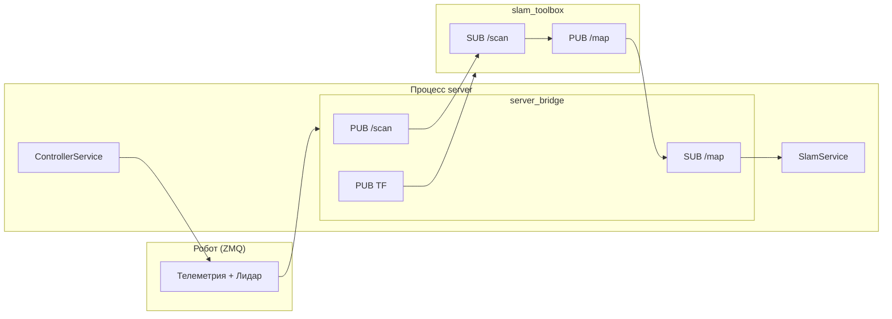
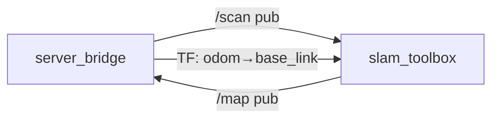

# ROS2: ноды, граф топиков и поведенческие профили

## 1. Ноды ROS2 в проекте LEO

В проекте участвуют следующие ROS2-ноды (реальные или ожидаемые для UI).

### 1.1. `server_bridge` (внутри процесса `server`)

**Файл:** `server/server/ros_node.py` (класс `Ros2ServerBridge`).

Единственная ROS2-нода, создаваемая кодом проекта. Инициализируется как `Node("server_bridge")` при старте сервера.

**Назначение:**
- Мост между «миром робота» (ZMQ-телеметрия/команды) и ROS2-экосистемой.
- Публикует данные лидара и TF для **slam_toolbox**.
- Подписывается на карту и TF для отображения SLAM в UI и выбора источника одометрии.

**Поведение по профилям:**
- Когда активный профиль сообщает `requires_slam=True` (например, `TeleopSlamProfile`) — `server_bridge` публикует `/scan` и odom-TF.
- Для остальных профилей SLAM-публикации выключены.

**Публикации:**
| Топик/сервис | Тип | Описание |
|--------------|-----|----------|
| `/scan` | `sensor_msgs/LaserScan` | Сканы лидара с робота (10 Hz), когда активен профиль с `requires_slam=True` |
| TF | `odom` → `base_link` | Поза робота (из одометрии или из SLAM при низкой уверенности одометрии) |
| TF (static) | `base_link` → `laser_frame`, `base_link` → `base_footprint` | Фиксированные рамки (лидар в начале base_link) |

**Подписки:**
| Топик | Тип | Обработчик | Описание |
|-------|-----|------------|----------|
| `/map` | `nav_msgs/OccupancyGrid` | `SlamService.try_subscribe_ros` → `on_map` | Карта от slam_toolbox; конвертируется в PNG и метаданные для UI |

**TF:** используется буфер + listener для преобразования `map` → `base_footprint` (поза в карте), обновление ~5 Hz в `SlamService._tf_lookup_pose`.

---

### 1.2. `slam_toolbox` (внешний пакет)

**Запуск:** опционально через `server/launch/teleop_slam.launch.py` (при установленном пакете `slam_toolbox`).

**Параметры:** `server/config/slam_params.yaml` (scan_topic: `/scan`, base_frame: `base_footprint`, odom_frame: `odom`, map_frame: `map`).

**Назначение:** 2D SLAM по лидару: построение карты, pose graph, loop closure. Публикует карту и обновляет TF (map↔odom).

**Публикации:**
| Топик | Тип | Описание |
|-------|-----|----------|
| `/map` | `nav_msgs/OccupancyGrid` | Occupancy grid карта |

**Подписки:**
| Топик | Тип | Описание |
|-------|-----|----------|
| `/scan` | `sensor_msgs/LaserScan` | Сканы лидара (источник — `server_bridge`) |

**TF:** читает odom↔base_footprint, публикует map↔odom (или эквивалент в зависимости от конфигурации slam_toolbox).

---

### 1.3. Ноды из реестра UI (`ros_graph_service`)

В `server/server/services/ros_graph_service.py` в `NODE_REGISTRY` перечислены ноды, которые показываются в веб-интерфейсе (состояние running/stopped, описание). Текущие launch-файлы **не** запускают их; это справочный список:

| Имя ноды | Описание (из реестра) | Топик для FPS |
|----------|------------------------|---------------|
| `server_bridge` | ROS2 bridge сервера: инициализация rclpy, управление нодами | — |
| `slam_toolbox` | 2D SLAM: построение карты по лидару, pose graph, loop closure | `/map` |
| `ekf_localization_node` | EKF: слияние одометрии колёс и IMU для odom→base_link | `/odometry/filtered` |
| `robot_state_publisher` | Публикация TF из URDF | `/robot_description` |

---

## 2. Граф подписок и публикаций

Ниже — граф топиков и TF между нодами, которые реально запускаются в LEO (server_bridge + опционально slam_toolbox).

```
                    ┌─────────────────────────────────────────────────────────┐
                    │                    server (процесс)                       │
                    │  ┌─────────────────────────────────────────────────────┐  │
                    │  │              server_bridge (ROS2 Node)              │  │
                    │  │                                                     │  │
                    │  │  PUB: /scan (LaserScan)  ──────────────────────────┼──┼──────┐
                    │  │        [только при requires_slam=True]              │  │      │
                    │  │  PUB: TF (odom→base_link, base_link→laser_frame,    │  │      │
                    │  │        base_link→base_footprint)                    │  │      │
                    │  │  SUB: /map (OccupancyGrid)  ◄───────────────────────┼──┼──┐   │
                    │  │  TF listener: map → base_footprint                  │  │  │   │
                    │  └─────────────────────────────────────────────────────┘  │  │   │
                    └─────────────────────────────────────────────────────────┘  │   │
                                                                                  │   │
     Данные с робота (ZMQ) ──► Ros2ServerBridge (телеметрия, лидар)               │   │
                                                                                  │   │
  ┌──────────────────────────────────────────────────────────────────────────────┘   │
  │                                                                                   │
  │   ┌─────────────────────────────────────────────────────────────────────────────┘
  │   │
  ▼   ▼
┌─────────────────────────────────────────────────────────────────────────────────────┐
│  slam_toolbox (внешний пакет, launch: teleop_slam.launch.py)                         │
│                                                                                     │
│  SUB: /scan (LaserScan)  ◄──────────────────────────────────────────────────────────┘
│  PUB: /map (OccupancyGrid) ─────────────────────────────────────────────────────────►
│  TF: map ↔ odom (и использование odom, base_footprint)                              │
└─────────────────────────────────────────────────────────────────────────────────────┘
```

**Итог по топикам:**
- **/scan** — издатель: `server_bridge`, подписчик: `slam_toolbox`.
- **/map** — издатель: `slam_toolbox`, подписчик: `server_bridge` (SlamService).
- **TF** — `server_bridge` публикует odom→base_link и статику base_link→laser_frame, base_footprint; slam_toolbox использует TF и может публиковать map↔odom.

### Диаграмма графа (Mermaid)



**Упрощённый граф топиков:**



---

## 3. Где определяется алгоритм поведения робота

Поведение робота задаётся **не в ROS2-нодах**, а на **сервере** (пакет `server`), в слое приложения.

### 3.1. Режимы управления (ControlMode)

В `server/server/models.py`:

```python
class ControlMode(str, Enum):
    PAUSE = "pause"
    TELEOPERATION = "teleoperation"
    TELEOP_SLAM = "teleop_slam"
    AUTONOMY_PROFILE_1 = "autonomy_profile_1"
```

Переключение режима: API `POST /api/mode` с телом `{"mode": "<value>"}` (см. `app_factory.py`).

### 3.2. Профили управления (новая архитектура)

Ключевая идея: `ControllerService` теперь является диспетчером цикла управления, а логика конкретного поведения инкапсулирована в профилях (`server/server/algorithms/profiles.py`).

- `ControllerService.tick_once()`:
  - собирает единый `InputState` (manual + telemetry + lidar/camera + SLAM + robot_config);
  - передаёт одноразовые действия в активный профиль (`on_action`);
  - вызывает `profile.tick(context, input_state)`;
  - отправляет `ControlCommand` в `robot_client`.
- Профиль:
  - хранит своё внутреннее состояние;
  - возвращает `ControlCommand`;
  - реализует hooks `on_activate`, `on_deactivate`, `post_tick`, `save_state`, `restore_state`.

`ControllerService` сохраняет в `server_state.yaml`:
- `active_mode`;
- `profile_states` (словарь сериализованного состояния каждого профиля).

В коде есть следующие профили:

| Режим | Профиль | Алгоритм (файл `server/server/algorithms/profiles.py`) |
|-------|---------|--------------------------------------------------------|
| **PAUSE** | `PauseProfile` | Нулевая команда |
| **TELEOPERATION** | `TeleoperationProfile` | WASD/мышь, head pan/tilt |
| **TELEOP_SLAM** | `TeleopSlamProfile` | Телеоп + `requires_slam=True` |
| **AUTONOMY_PROFILE_1** | `AutonomyProfile1` | Заглушка автономии |

Дополнительно добавлен скелет:
- `FollowingProfile` — архитектурный шаблон для поведения «следовать за человеком/другом» с TODO-комментариями по vision + lidar + planner пайплайну.

Цикл управления: в `main.py` запускается `controller.start_command_loop(cfg.app.command_hz)`.
Команды движения по-прежнему уходят через `robot_client.send_command(command)` (ZMQ), **не через ROS**.

### 3.3. Сводка по режимам и ROS

| Режим | Алгоритм поведения | Роль ROS (server_bridge) |
|-------|--------------------|---------------------------|
| **PAUSE** | Останов, нулевая команда | Не публикует /scan и odom TF |
| **TELEOPERATION** | Телеуправление (WASD, голова) | Не публикует /scan и odom TF |
| **TELEOP_SLAM** | Телеуправление + питание SLAM | Публикует /scan и TF, подписывается на /map |
| **AUTONOMY_PROFILE_1** | Заглушка автономии | Не публикует /scan и odom TF |

Итого: **алгоритм поведения** определяется профилями в `server/server/algorithms/profiles.py`, а `ControllerService` обеспечивает orchestration и доставку данных в профиль. ROS2 используется для стыковки с slam_toolbox (лидар, карта, TF) и не формирует команды движения напрямую.
